# Transaction Data Pipeline

## Project Description

This project is a data pipeline for managing a bank's transactional data. The pipeline utilizes various technologies to ensure data integrity, perform validation checks, and provide visualization capabilities.

- **Data Storage and Processing:**
  - **Google Cloud Storage:** Used to store the bank's raw transactional data.
  - **MongoDB:** Store each transaction as a document for each transaction in an object of GCS
  - **Google Cloud Function:** Ensures that the data is properly deposited into the Google Cloud Storage bucket.

- **Data Validation and Notification:**
  - **Data Validation Rules:** A set of rules is applied to each transactional data to check for inconsistencies.
  - **Email Notification:** If any inconsistencies are found, an email is sent to the user.

- **Data Visualization:**
  - **Streamlit:** Used for data visualization on the backend.

## Technologies Used

The following technologies are used in this project:

### Data Storage and Processing

- **Google Cloud Storage**
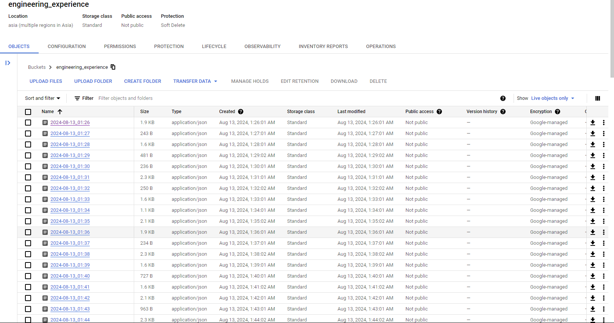
- **Google Cloud Function**
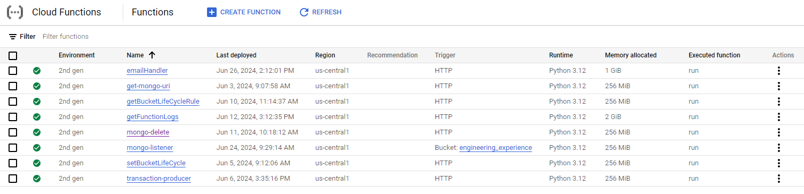
- **MongoDB**
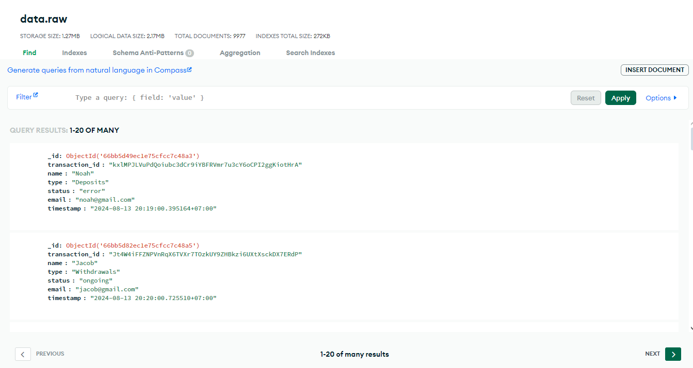

### Data Validation and Notification

- **Cloud Storage Lifecycle**
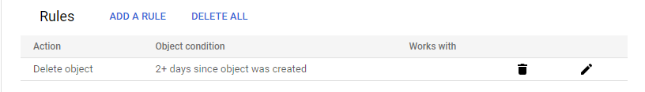
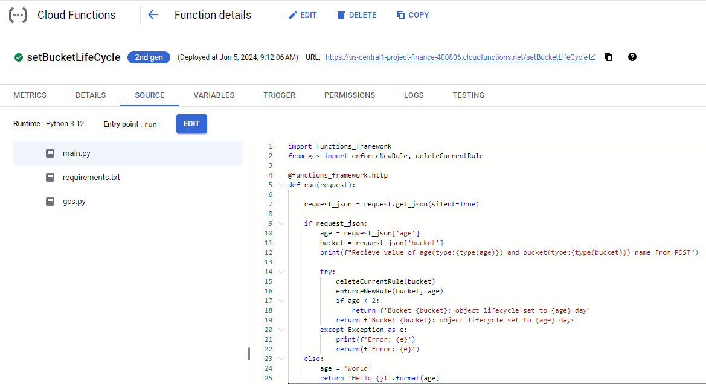

- **MongoDB Lifecycle**
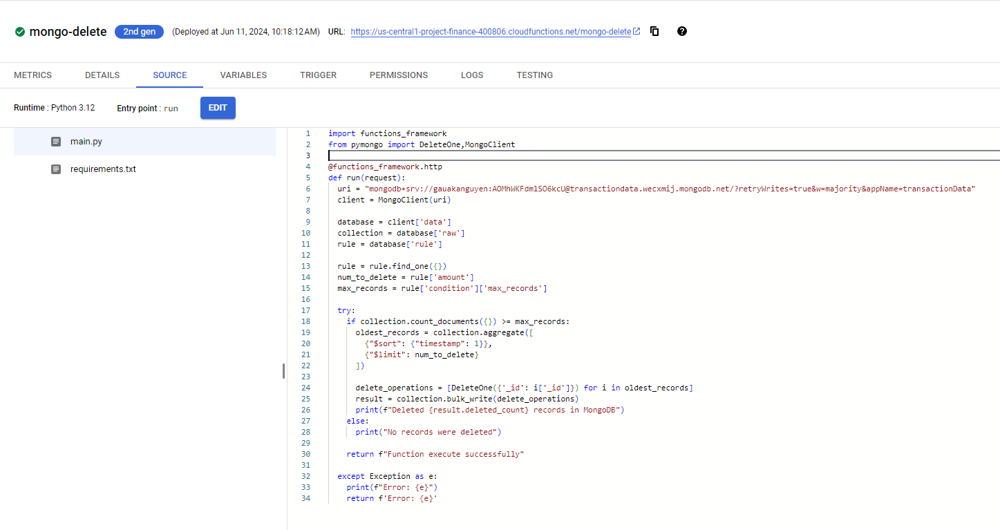
- **Email Notification**
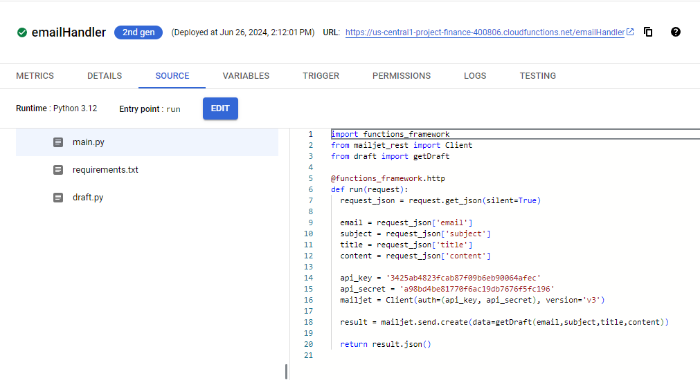
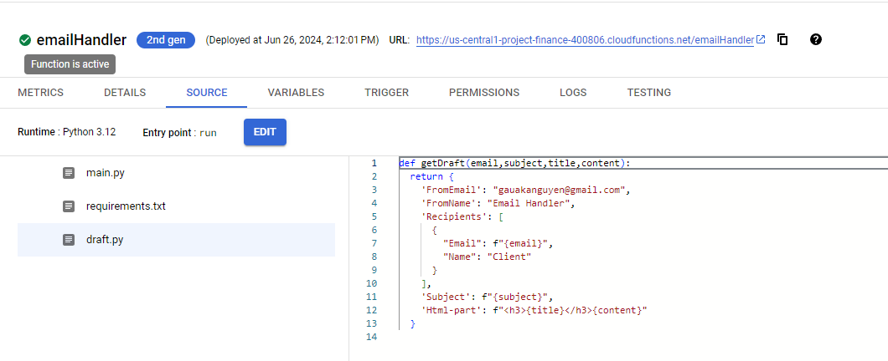

### Data Visualization Using Streamlit (admin view)
[Visit the Streamlit Dashboard](https://engineering-experience-gviin2cbcluvttvqhstftc.streamlit.app)
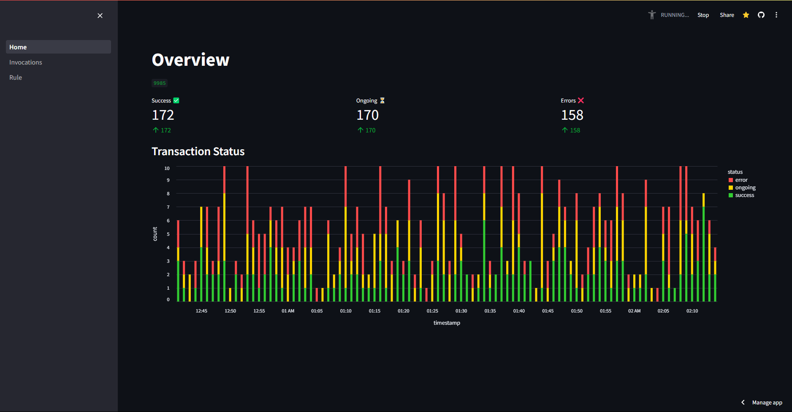
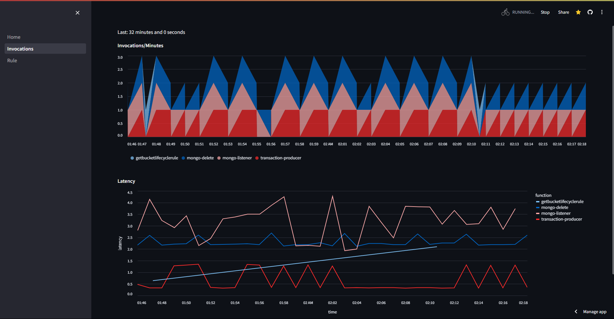
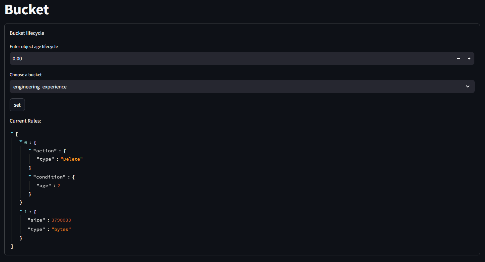
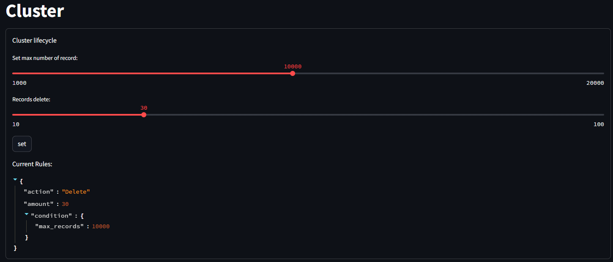

For more information on this project progression, please visit the reports section.
## License

This project is licensed under the [MIT License](LICENSE).
